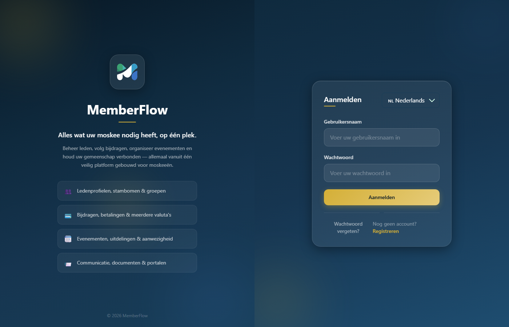
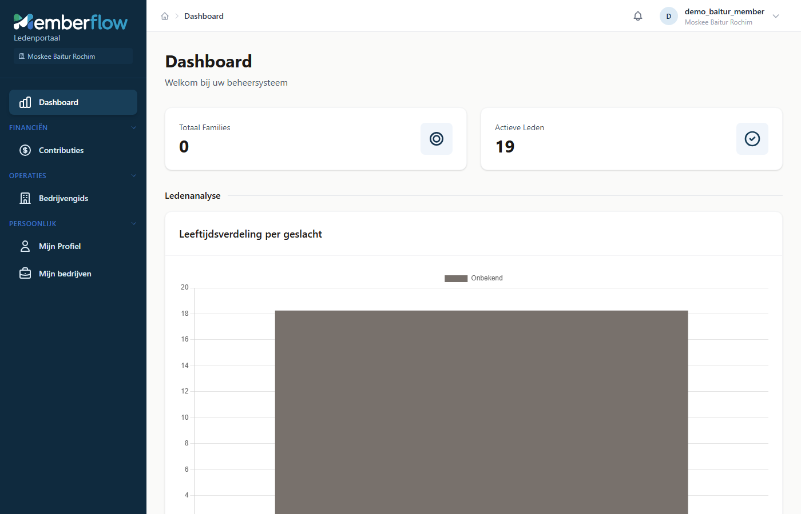
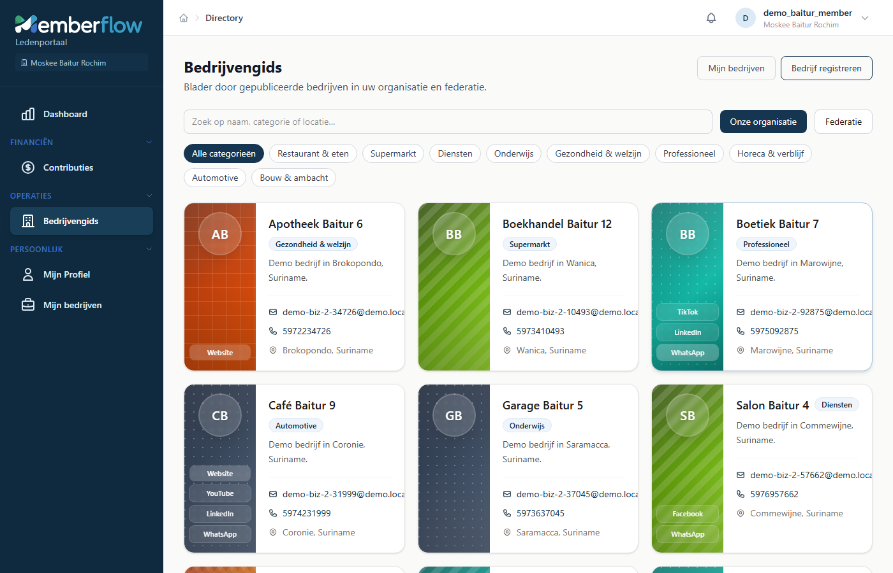
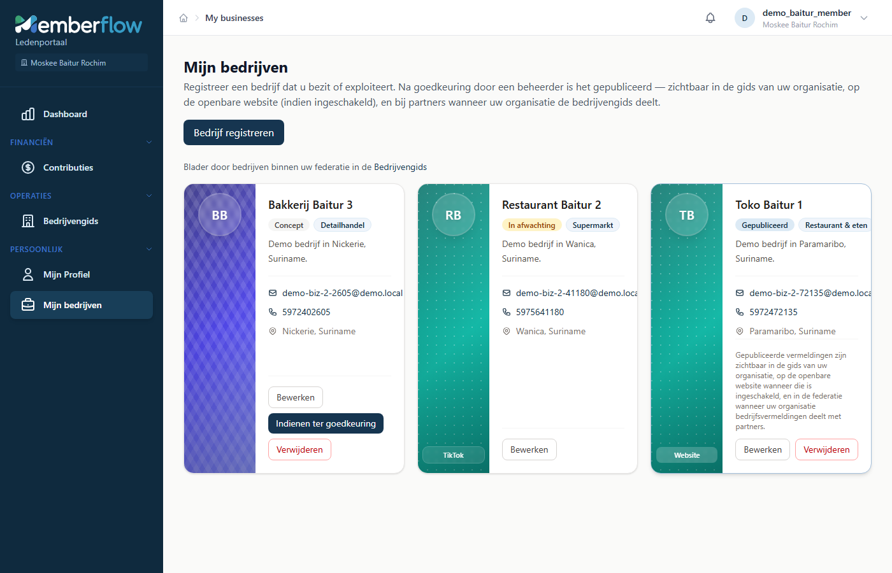
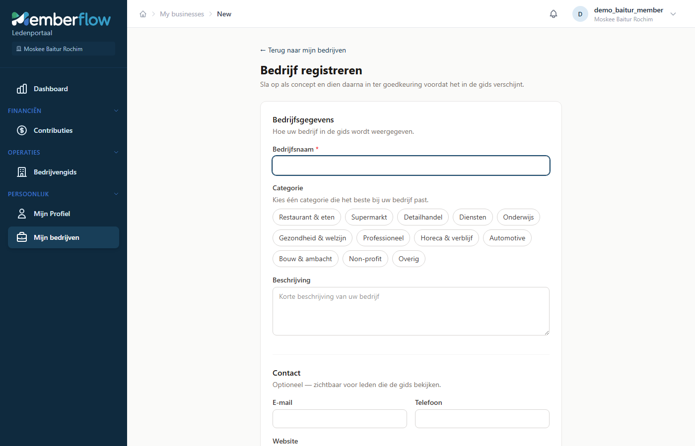
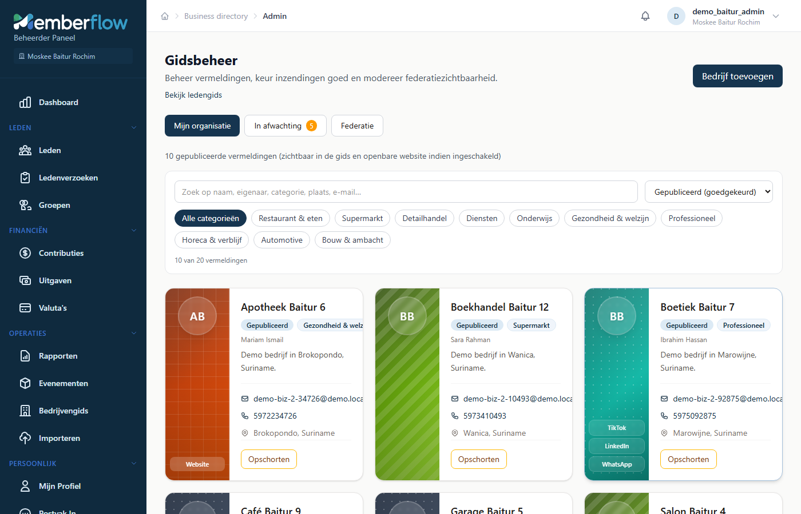
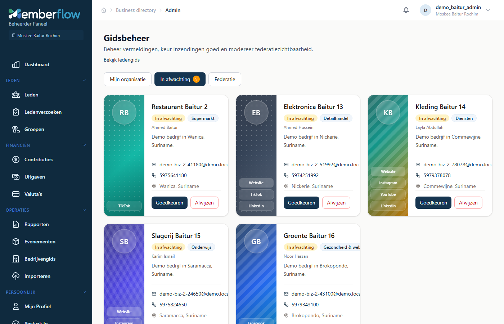
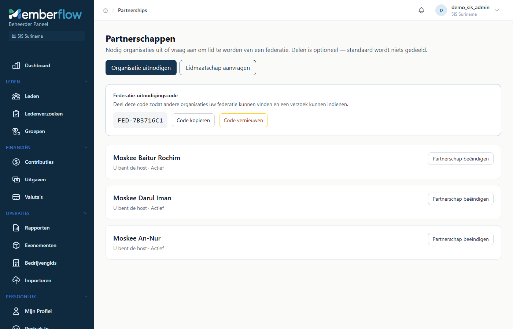

# MemberFlow Gebruikershandleiding

Een eenvoudige handleiding voor moskeemedewerkers en leden. De schermafbeeldingen komen uit de **Suriname-demo**-omgeving.

---

## Wat is MemberFlow?

MemberFlow helpt uw moskee bij het beheren van leden, contributies, evenementen en een **bedrijvengids** — een overzicht van betrouwbare bedrijven van mensen uit uw gemeenschap.

Organisaties kunnen ook een **federatie** (partnerschap) vormen. Een koepelorganisatie zoals RBSIS Paramaribo kan bijvoorbeeld samenwerken met lokale moskeeën, zodat gedeelde bedrijven in het hele netwerk zichtbaar worden.

---

## Demo-accounts (voor training)

Alle demo-gebruikers hebben hetzelfde wachtwoord: **`DemoPass123!`**

| Rol | Gebruikersnaam | Organisatie | Geschikt voor |
|-----|----------------|-------------|---------------|
| Federatiebeheerder | `demo_rbsis_admin` | RBSIS Paramaribo | Partnerschappen, federatie-overzicht |
| Moskeebeheerder | `demo_baitur_admin` | Moskee Baitur Rochim | Bedrijven goedkeuren, directorybeheer |
| Lid (portaal) | `demo_baitur_member` | Moskee Baitur Rochim | Eigen bedrijven registreren |

Andere moskeeën (Darul Iman, An-Nur) volgen hetzelfde patroon: `demo_darul_admin`, `demo_annur_member`, enzovoort.

---

## 1. Inloggen

1. Open de MemberFlow-inlogpagina.
2. Kies indien nodig uw taal (English of Nederlands).
3. Vul uw **gebruikersnaam** en **wachtwoord** in.
4. Klik op **Sign In** / **Inloggen**.

Na een geslaagde login komt u op het **Dashboard**.

---

## 2. Dashboard

Het dashboard is uw startscherm. U ziet hier een kort overzicht van uw organisatie (bijvoorbeeld actieve leden en eenvoudige grafieken).

**Wat kunt u hier doen?**

- Gebruik het **linkermenu** om onderdelen te openen.
- Rechtsboven staan uw naam en organisatie.
- Via het bel-icoon opent u meldingen.

---

## 3. De bedrijvengids bekijken

Open **Operations → Business Directory** (of in het Nederlands: **Bedrijvengids**).

Hier kunt u:

- Zoeken op naam, categorie of locatie
- Filteren op categorie (Restaurant, Booodschappen, Gezondheid, enzovoort)
- Wisselen tussen **Onze organisatie** en **Federatie** (partnermoskeeën)

Elke kaart toont de bedrijfsnaam, categorie, korte omschrijving en contactgegevens. Sommige kaarten tonen ook website- of socialemedialinks in de gekleurde zijbalk.

---

## 4. Uw eigen bedrijf registreren (leden)

Leden met een gekoppeld ledenprofiel kunnen hun eigen bedrijf registreren.

1. Open **Personal → My Businesses** (of **Mijn bedrijven**).
2. Klik op **Register Business** / **Bedrijf registreren**.

U ziet de status van elk bedrijf:

| Status | Betekenis |
|--------|-----------|
| **Draft** / Concept | Opgeslagen, nog niet ter review aangeboden |
| **Pending approval** / Wacht op goedkeuring | Wacht op een beheerder |
| **Published** / Gepubliceerd | Zichtbaar in de gids |
| **Suspended** / Opgeschort | Tijdelijk verwijderd door een beheerder |

### Het formulier invullen

Op **Bedrijf registreren** vult u in:

- Bedrijfsnaam en categorie  
- Optioneel: omschrijving, e-mail, telefoon  
- Optioneel: website en socialemedialinks  
- Stad en land  

Klik daarna op **Save as draft** / **Opslaan als concept**. Als u klaar bent, opent u het bedrijf opnieuw en kiest u **Submit for approval** / **Indienen ter goedkeuring**.

> **Tip voor beheerders:** Accounts die *niet* aan een ledenprofiel gekoppeld zijn, kunnen Mijn bedrijven niet gebruiken. Gebruik dan **Directorybeheer** om organisatiesvermeldingen te beheren.

---

## 5. Bedrijven goedkeuren (beheerders)

Moskeebeheerders openen **Administration → Directory Admin** (of **Directorybeheer**).

Hier kunt u:

- Alle lokale bedrijven bekijken  
- Aanvragen onder **Pending approval** / **Wacht op goedkeuring** beoordelen  
- Vermeldingen publiceren, afwijzen of opschorten  
- Beheren wat met federatiepartners wordt gedeeld  

### Een aanvraag goedkeuren

1. Open het tabblad **Pending approval** / **Wacht op goedkeuring**.
2. Controleer de bedrijfsgegevens.
3. Kies **Approve** / **Goedkeuren** (of wijs af met een reden).

Na goedkeuring verschijnt het bedrijf in de bedrijvengids voor uw leden (en in de federatie als delen is ingeschakeld).

---

## 6. Partnerschappen (federatie)

Koepelorganisaties (zoals RBSIS Paramaribo) beheren partnerschappen via **Administration → Partnerships** (of **Partnerschappen**).

Op dit scherm kunt u:

- Partnermoskeeën en hun status bekijken  
- Een andere organisatie uitnodigen, of een verzoek accepteren  
- Een **uitnodigingscode** delen zodat anderen uw federatie kunnen vinden  
- Kiezen wat u deelt (bijvoorbeeld de bedrijvengids)

**Typische rollen**

- **You are the host** / **U bent de host** — uw organisatie is de koepel (federatie).  
- **You are the partner** / **U bent de partner** — uw moskee is lid van een koepel.

Delen is optioneel. Er wordt niets gedeeld totdat een beheerder delen inschakelt.

---

## 7. Praktische tips

1. **Verkeerde organisatie?** Controleer de naam onder uw profiel rechtsboven. Demo-accounts horen elk bij één moskee.
2. **Kunt u geen bedrijf registreren?** Uw login moet aan een ledenprofiel gekoppeld zijn. Vraag een beheerder, of gebruik een ledenaccount zoals `demo_baitur_member`.
3. **Bedrijf niet zichtbaar?** Het moet **Published** / **Gepubliceerd** zijn. Concepten en wachtende aanvragen blijven privé tot ze zijn goedgekeurd.
4. **Taal** — schakel English / Nederlands in via de inlogpagina of accountvoorkeuren waar beschikbaar.

---

## Snelpad: de volledige bedrijfsflow oefenen

1. Log in als **`demo_baitur_member`** / `DemoPass123!`  
2. Open **Mijn bedrijven** → registreer of dien een concept in.  
3. Log uit en log in als **`demo_baitur_admin`** / `DemoPass123!`  
4. Open **Directorybeheer** → **Wacht op goedkeuring** → Goedkeuren.  
5. Open de **Bedrijvengids** om de publicatie te zien.  
6. Log in als **`demo_rbsis_admin`** om **Partnerschappen** en federatiedelen te bekijken.
