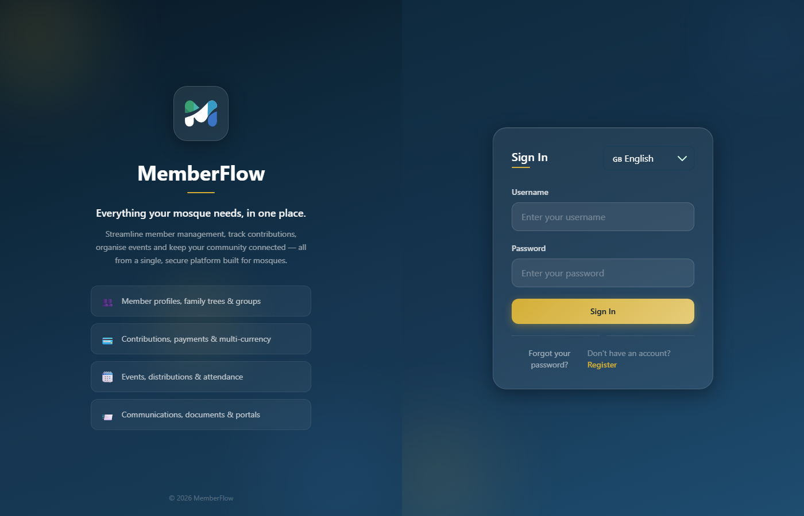
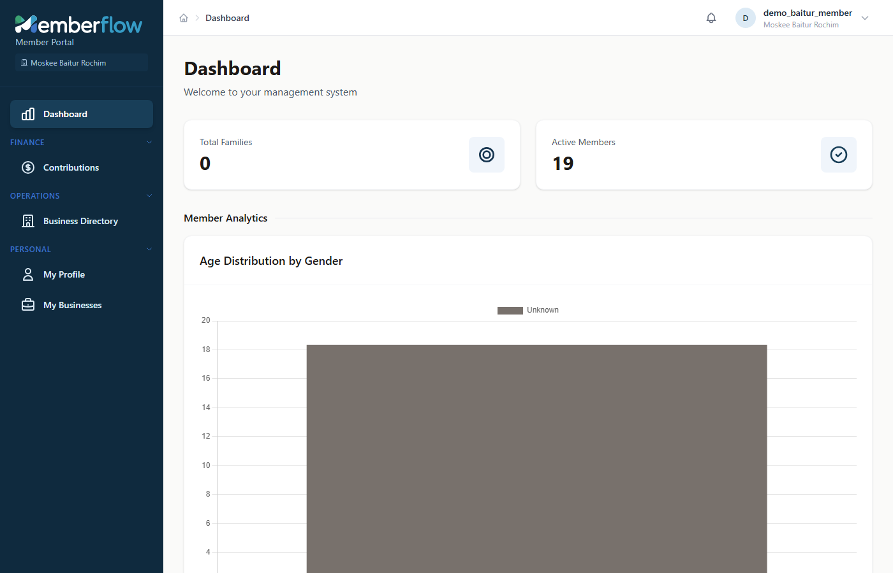
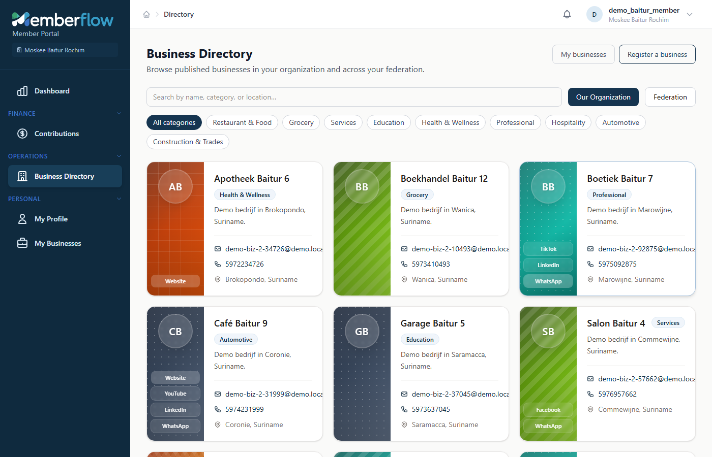
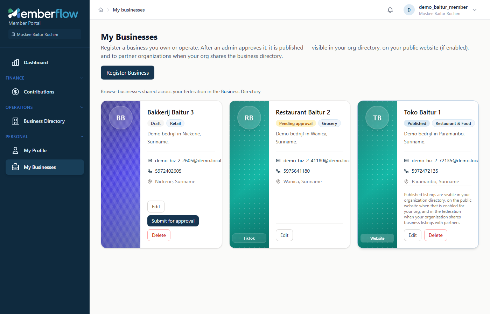
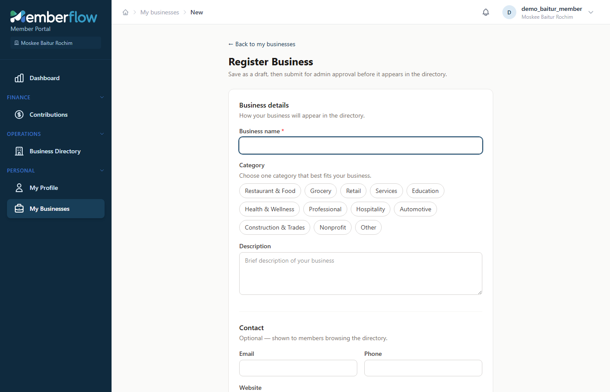
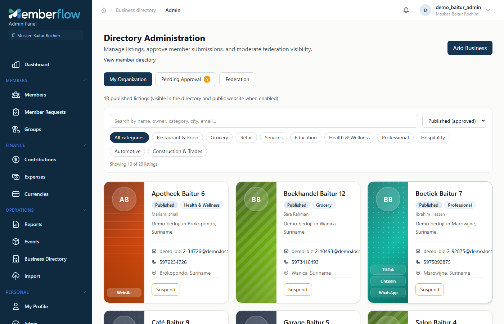
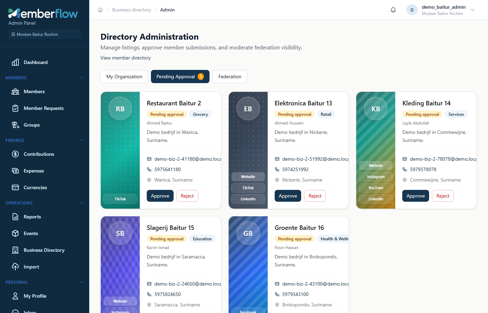
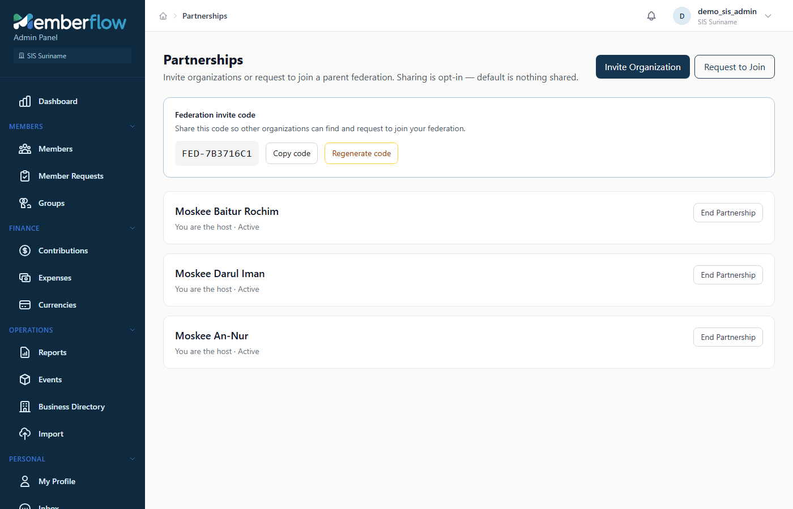

# MemberFlow User Guide

A simple guide for mosque staff and members. Screenshots are from the **Suriname demo** environment.

---

## What is MemberFlow?

MemberFlow helps your mosque manage members, contributions, events, and a **business directory** — a list of trusted businesses run by people in your community.

Organizations can also form a **federation** (partnership). For example, a parent organization like RBSIS Paramaribo can partner with local mosques so shared businesses appear across the network.

---

## Demo accounts (for training)

All demo users share the password: **`DemoPass123!`**

| Who | Username | Organization | Best for |
|-----|----------|--------------|----------|
| Federation admin | `demo_rbsis_admin` | RBSIS Paramaribo | Partnerships, federation overview |
| Mosque admin | `demo_baitur_admin` | Moskee Baitur Rochim | Approving businesses, directory admin |
| Member (portal) | `demo_baitur_member` | Moskee Baitur Rochim | Registering your own businesses |

Other mosques (Darul Iman, An-Nur) have the same pattern: `demo_darul_admin`, `demo_annur_member`, and so on.

---

## 1. Sign in

1. Open the MemberFlow login page.
2. Choose your language (English or Nederlands) if needed.
3. Enter your **username** and **password**.
4. Click **Sign In**.

After a successful login you land on the **Dashboard**.

---

## 2. Dashboard

The dashboard is your home screen. It shows a quick overview of your organization (for example active members and simple charts).

**Where to go next**

- Use the **left menu** to open Features.
- Your name and organization appear at the top right.
- Use the bell icon for notifications.

---

## 3. Browse the Business Directory

Open **Operations → Business Directory**.

Here you can:

- Search businesses by name, category, or location
- Filter by category (Restaurant, Grocery, Health, and so on)
- Switch between **Our Organization** and **Federation** (partner mosques)

Each card shows the business name, category, short description, and contact details. Some cards also show website or social media links on the coloured side panel.

---

## 4. Register your own business (members)

Members who have a linked member profile can register businesses they own.

1. Open **Personal → My Businesses**.
2. Click **Register Business**.

You will see the status of each business:

| Status | Meaning |
|--------|---------|
| **Draft** | Saved, not yet sent for review |
| **Pending approval** | Waiting for an admin |
| **Published** | Visible in the directory |
| **Suspended** | Temporarily removed by an admin |

### Fill in the form

On **Register Business**, enter:

- Business name and category  
- Optional description, email, phone  
- Optional website and social links  
- City and country  

Then **Save as draft**. When you are ready, open the business again and choose **Submit for approval**.

> **Note for admins:** Accounts that are *not* linked to a member profile cannot use My Businesses. Use **Directory Admin** instead to manage organization listings.

---

## 5. Approve businesses (admins)

Mosque admins open **Administration → Directory Admin** (or **Directory Administration**).

Here you can:

- See all local businesses  
- Review **Pending approval**  
- Publish, reject, or suspend listings  
- Manage what is shared with federation partners  

### Approve a pending listing

1. Open the **Pending approval** tab.
2. Review the business details.
3. Choose **Approve** (or reject with a reason if needed).

After approval, the business appears in the Business Directory for your members (and in the federation when sharing is enabled).

---

## 6. Partnerships (federation)

Parent organizations (like RBSIS Paramaribo) manage partnerships under **Administration → Partnerships**.

From this screen you can:

- See partner mosques and their status  
- Invite another organization, or accept a request  
- Share an **invite code** so others can find your federation  
- Choose what to share (for example the business directory)

**Typical roles**

- **You are the host** — your organization is the parent (federation).  
- **You are the partner** — your mosque joined a parent federation.

Sharing is optional. Nothing is shared until an admin turns sharing on.

---

## 7. Everyday tips

1. **Wrong organization?** Check the name under your profile at the top right. Demo users belong to one mosque each.
2. **Cannot register a business?** Your login must be linked to a member profile. Ask an admin, or use a member account such as `demo_baitur_member`.
3. **Business not visible?** It must be **Published**. Draft and pending items stay private until approved.
4. **Language** — switch English / Nederlands from the login page or account preferences where available.

---

## Quick path: try the full business flow

1. Sign in as **`demo_baitur_member`** / `DemoPass123!`  
2. Open **My Businesses** → register or submit a draft.  
3. Sign out, then sign in as **`demo_baitur_admin`** / `DemoPass123!`  
4. Open **Directory Admin** → **Pending approval** → Approve.  
5. Open **Business Directory** to see it published.  
6. Sign in as **`demo_rbsis_admin`** to review **Partnerships** and federation sharing.
